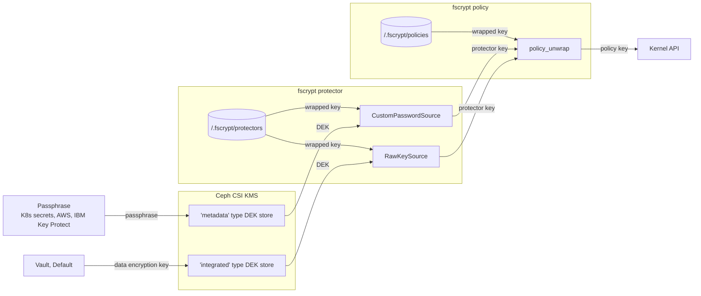

# Ceph Filesystem fscrypt Support

## Problem Description

As a Ceph Container Storage Interface (Ceph CSI) user, I want a cloud native way
to manage keys and enable encryption on Ceph Filesystem (CephFS) volumes.

In order to access encrypted volumes without Ceph CSI, this can be done by unlocking
volumes with user space tools.

## Background

*fscrypt* or *FSCrypt* is a Linux Kernel feature that allows the filesystem
to support the transparent encryption of files and directories. Local
filesystems like ext4 and F2FS (Flash-Friendly File System) support this feature
already.

Work is in progress to add fscrypt support to CephFS for filesystem-level encryption.

- [FSCrypt Kernel Documentation](https://www.kernel.org/doc/html/latest/filesystems/fscrypt.html)
- Management Tools
   - [`fscrypt`](https://github.com/google/fscrypt)
   - [`fscryptctl`](https://github.com/google/fscryptctl)
- [Ceph Feature Tracker: "Add fscrypt support to the kernel CephFS client"](https://tracker.ceph.com/issues/46690)
- [`fscrypt` design document](https://goo.gl/55cCrI)

**NOTE:** In this document, fscrypt refers to the filesystem-level encryption
feature, while `fscrypt` specifically refers to the user space tool.

## Terminology

- *FSCrypt*, *fscrypt* - Linux Kernel filesystem-level encryption feature
- `fscrypt` (code formatted) - User space tool manage keys and encryption policies
- `fscryptctl` (code formatted) - Low-level user space tool manage
  keys and encryption policies
- *subvolume* - CephFS subvolume
- *unlocking* - Using a key to make an encrypted filesystem
  accessible in plain text
- *protector* (fscrypt) - A single method or secret plus data used to
  derive a *protector key*. Example: user login passphrase
- *protector key* (fscrypt) - A symmetric key derived from an external
  source. Used by a *policy* to unwrap a *policy key*
- *policy key* (fscrypt) - An encryption key passed to the kernel to
  unlock a directory
- *policy* (fscrypt) - A collection of directories protected and unlocked as a unit
- *KMS* - Key management system

## User Visible Change

Similar to the existing RADOS Block Device (RBD) encryption support,
we propose adding encryption support in the configuration and Key
Management Service (KMS) integration.

In this example, a user may enable encryption using storage class keys similar
to RBD. Ceph CSI then configures and unlocks the persistent volumes and CephFS
subvolumes.

Due to the way `fscrypt` stores metadata, subvolumes have a regular root
directory containing  a `/.fscrypt` directory and a
`/ceph-csi-encrypted` directory. The first contains `fscrypt` metadata; the
latter is the fscrypt-enabled directory made that is accessible to pods.

Example configuration using a secrets-based KMS:

```yaml
apiVersion: v1
kind: Secret
metadata:
  name: cephfs-storage-encryption-secret
stringData:
  encryptionPassphrase: verysecretpassword
---
apiVersion: storage.k8s.io/v1
kind: StorageClass
metadata:
  name: csi-cephfs-sc-encrypted
provisioner: cephfs.csi.ceph.com
parameters:
  clusterID: <cluster-id>
  fsName: cephfs

  encrypted: "true"
  encryptionKMSID: "user-ns-secrets-metadata"

  csi.storage.k8s.io/provisioner-secret-name: csi-cephfs-secret
  csi.storage.k8s.io/provisioner-secret-namespace: default
  csi.storage.k8s.io/controller-expand-secret-name: csi-cephfs-secret
  csi.storage.k8s.io/controller-expand-secret-namespace: default
  csi.storage.k8s.io/node-stage-secret-name: csi-cephfs-secret
  csi.storage.k8s.io/node-stage-secret-namespace: default
reclaimPolicy: Delete
allowVolumeExpansion: true
mountOptions:
  - debug
```

The change will leverage the existing Ceph CSI KMS and support any
integration now available to RBD encryption

## Implementation

We suggest to leverage the encryption features in Ceph CSI and integrate
that with `fscrypt`, a Go tool, and the library for key management and configuration
of the fscrypt kernel feature.

Ceph CSI and `fscrypt` have a lot of overlap between their key management
features. The Key Management section will go into detail on how and where keys
are managed.

- Ceph CSI provides the user facing configuration and access to key
  management systems
- `fscrypt` handles key derivation, storage of wrapped keys and metadata

The current CephFS subvolume root will remain untouched with the exception that
the subvolume root is not bind mounted into the pod, but rather a well-known
subdirectory. The root will contain a `/.fscrypt` directory managed by `fscrypt`.

`fscrypt` requires access to a mounted filesystem and therefore the encryption setup
must take place in the `NodeStageVolume` request handler instead of `CreateVolume`.
This is the same case for RBD. The set up will take place right between
subvolume mount and bind mount to the container namespace.

Additional checks after unlocking will ensure that a container operates on an
unlocked encrypted directory and never on directory that has fscrypt enabled.

### Key Management



The diagram shows the keys flowing from Ceph CSI to the Kernel API unlocking
a directory. On the way, key material from Ceph CSI passes two key derivation
steps in fscrypt:

- *protectors* and
- *policies*

`fscrypt` supports multiple *protectors*. These may source secrets from login
passwords, custom passwords or soon Ceph CSI. Unlocking a protector
yields a *protector key* that is then used to unlock a *policy*.

A *policy* may unlock multiple directories. In our case there will be
only a single policy for a single well-known directory on the subvolume root.
A policy is used to derive a *policy key*, which is passed to the Kernel API
along with other settings, such as the desired encryption algorithm.

Going back to the beginning of the diagram and looking at the interface between
`fscrypt` and Ceph CSI one can see that the two data encryption key (DEK)
styles (*metadata* and *integrated*) map to different `fscrypt` protectors.

The `fscrypt` protector of key sources `CustomPasswordSource` and `RawKeySource`
differ in how they derive a key from a source. Refer to the `fscrypt` design
doc for details.

Metadata DEKs: In the RBD case, Ceph CSI stores a wrapped key in the
RBD volume metadata and then a user configured secret (for example, a Kubernetes
secret) is passed to a key derivation function (KDF) to then unwrap the
key. The resulting key unlocks the volume.

Since `fscrypt` already stores wrapped keys there is no need for an
extra layer of wrapping. We can also skip the KDF and use a
`CustomPasswordSource` to pass the Ceph CSI secret directly to
`fscrypt`.

With integrated DEKs (for example, Vault) Ceph CSI uses a key from a KMS
directly. To integrate this with `fscrypt` we use a
`RawKeySource`, that is similar to a `CustomPasswordSource`, but skips
the KDF.

As the diagram shows, both policies and protectors require a metadata
store. The default `fscrypt` data store is in a `/.fscrypt`
directory under a filesystem root. The `fscrypt` design doc details
alternatives and explains what data is stored.

To be compatible with `fscrypt`, this directory requires support as
well. The downside of this is that we lose the CephFS subvolume root to
metadata and encrypted data will reside under a well-known
subdirectory (for example, `/ceph-csi-encrypted`).

## Dependencies

The proposed change is tailored to CephFS and requires CephFS support
to work *with* CephFS. The kernel APIs however are not specific to
CephFS and are unlikely to change as they only deal with configuration
and key management. There is no direct dependency on CephFS. Using the
proposed features will simply fail at runtime, when neither Ceph nor
the Kernel have the appropriate support. At build time this feature
does not require CephFS fscrypt support.

Runtime dependencies:

- Kernel >= v5.4 with `CONFIG_FS_ENCRYPTION=y`
- CephFS kernel client fscrypt support [Ceph Feature Tracker](https://tracker.ceph.com/issues/46690)

Build dependencies:

- `google/fscrypt` library, which has minimal build dependencies
  ([fscrypt doc](https://github.com/google/fscrypt#building-and-installing))

## Alternatives

### [ceph-csi-kms] Key Management: Policy Key Directly From Ceph CSI

A simpler approach to the one proposed above, but incompatible with
`fscrypt`. To unlock a subvolume, the user would have to use Ceph CSI.
The implementation is similar to the RBD encryption feature.
It uses the low-level `fscryptctl` tool to set a policy key
from a Ceph CSI data encryption key.

Ceph CSI KMS requires metadata data encryption key storage that can use
xattrs on a mounted CephFS filesystem.

A prototype showing this approach is available: [repository](https://github.com/irq0/ceph-csi/tree/wip/fscrypt)

Benefits:

- Simpler key wrapping
- No `/.fscrypt` on the subvolume root

Drawbacks:

- `fscryptctl` is a C tool and does not lend itself to be integrated into Ceph CSI
- Incompatible with `fscrypt`
- Does not support unlocking with any of possibly multiple keys
  configured (`fscrypt` protectors feature)

### [manual] Manual Setup

For completeness, a user may set up FSCrypt without any support in
Ceph CSI. Both `fscrypt` and `fscryptctl` work in containers
and may even be used with the proposed change or alternative [ceph-csi-kms].

The following links provide examples from the documentation that also apply to
CephFS:

- [fscrypt example usage](https://github.com/google/fscrypt#example-usage)
- [fscryptctl example usage](https://github.com/google/fscryptctl#example-usage)

### [subdirs] Support Unlocking Arbitrary subdirs (instead of subvolume basis)

An extension to the proposal: As mentioned in the implementation section, a
`fscrypt` policy may apply to multiple directories and from a set of protectors
any suffices to unlock a policy. A user may configure a complex mapping of
subdirectories and Ceph CSI secret sources to unlock different parts of a CephFS
subvolume with different keys.
