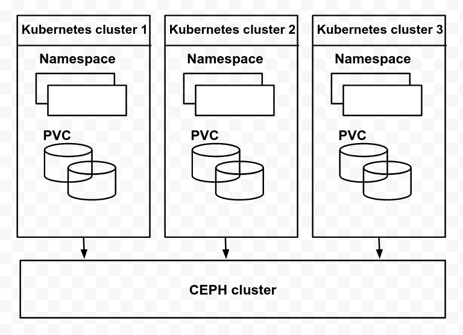

# Metro-HA Disaster Recovery

## Summary

In the case of metro DR, a single ceph cluster is used between multiple
kubernetes clusters, For disaster recovery the applications from one kubernetes
cluster will be moved to another kubernetes cluster (expected that namespace
name and the pvc name remains same) as a single ceph cluster is used by all
kubernetes cluster the cephcsi running on the cluster where failover/fallback
is happening should be able to identify the underlying RBD/CephFS volume and
reattach to the PV.

## Architecture

### Design

Currently, ceph-csi generates its unique ID for volume and stores the
corresponding PV name and the unique ID mapping, It creates the backend volume
with the unique ID and returns the encoded value which contains all the
required information for other operations. For metro DR, the same volume needs
to be used in the secondary Kubernetes cluster. In the secondary cluster, the
cephcsi cannot identify the volume corresponding to the PVC. Based on the
assumption that the Kubernetes namespace and the PVC name remain the same when
admin is doing the failover/fallback cephcsi can use the PVC name and namespace
name to identify the RBD image. For that cephcsi needs to make a few changes.

### Pre-req

* The PVC name and namespace need to be passed to the CSI driver as part of the
  volume create request.
* A new storage-class parameter to indicate that image name need to be derived
  from PVC name and namespace name.
* An unique ID in the cephcsi ceph cluster configmap

In the case of the primary cluster as the PVC name and the namespace name
should be sent in volume create request, the cephcsi will generate omap data
and creates its request name (PV name) and unique ID mapping in omap
`csi.volume.<uniqueID>.PVName` : `volume UUID` (this is required to identify
the RBD image/cephFS subvolume belongs to the PV) and creates an RBD image with
the name `csi-vol-<pvcname>-<namespacename>-<UUID>`.  When doing the failover,
cephcsi in the secondary cluster will check the volume is already present, If
the image is present cephcsi will add its request name(PV Name) mapping to the
UUID (`csi.volume.<uniqueID>.PVName` : `volume UUID`). As ID passed in
configmap is unique across all the cephcsi instances accessing the ceph cluster
will help cephcsi to identify the volume. Retaining the same image OMap is
useful to preserve and reuse the volumeContext, and hence better, than creating
a separate image OMap per peer kubernetes cluster that is sharing Ceph pool.

Currently, we are making use of watchers in node stage request to make sure RWO
PVC is mounted on a single node at a given point of time. If the unmap is not
done on a cluster where rbd image is mounted the watcher won't be removed,
cephcsi need to take care of handling stale watchers when the workload comes up
on another kubernetes cluster.

In case of the PVC is Retained and recreated with the same name in the same
namespace as the request name is unique cephcsi will not return the underlying
storage. But if the PVC is Retained on one cluster and PVC gets created with
the same name in the same namespace in another cluster will get underlying
storage (it won't create a new volume (the support for the need to be added
later by marking RBD/CephFS storage for not to be reused))

When cephcsi receives a request for Delete operation it will delete the backend
storage and all OMap entries as well and thus clean up the state for all peer
kubernetes clusters.

#### Pseudo code

* CreateVolume
  * CheckVolExists
    * if PVCNaming:
      * List and check if the image exists, and is still unbound to a request
        in this cluster, if so bind it and update common image OMap
    * Else:
      * Create a new volume
* DeleteVolume
  * Determine image OMap, and store it
  * Delete image
  * Delete image OMap
  * Recursively delete CSI OMap keys from RequestName in image OMap

As the volumeID is generated in Create operation, all other operations based on
volumeID remains the same.

### secnerios

**Setup:**

**Scenario 1: Single shared pool across peer kubernetes clusters:**

* Kubernetes cluster-a
  * ceph-csi config map
    * clusterID: ceph-cluster-foo
      * uniqueID: bar
* Kubernetes cluster-b
  * ceph-csi config map
    * clusterID: ceph-cluster-foo
      * uniqueID: baz
* Kubernetes cluster-c
  * ceph-csi config map
    * clusterID: ceph-cluster-foo
      * uniqueID: qux
* StorageClass-ceph:
  * clusterID: ceph-cluster-foo
  * PVCNaming: true
* PVC:
  * StorageClaassName: StorageClass-ceph

In the above scenario, a single pool is shared across the kubernetes clusters.
The storageclass parameter `PVCNaming: true` is set the volume will be named
based on the PVC Name and Namespace Name with cephcsi uniqueID. Each cephcsi
configuration will have a different unique ID when the cephcsi gets the request
for Create operation each will update the omap data with a unique identifier
(`csi.volume.<uniqueID>.PVName` : `volume UUID`). Whenever a workload moved
from one kubernetes cluster to another kubernetes cluster the same omap data
will be updated with unique Identity for easier identification as cephcsi
operations need to be idempotent.

Note:- The admin has to make sure the uniqueID is not the same across cephcsi
instances when all cephcsi instances are connected to a single ceph cluster.

**Scenario 2: Affined pool (pool per peer kubernetes cluster):**

* Kubernetes cluster-a
  * ceph-csi config map
    * clusterID: ceph-cluster-foo
      * uniqueID: bar
* Kubernetes cluster-b
  * ceph-csi config map
    * clusterID: ceph-cluster-foo
      * uniqueID: baz
* Kubernetes cluster-c
  * ceph-csi config map
    * clusterID: ceph-cluster-foo
      * uniqueID: qux
* StorageClass-a:
  * clusterID: ceph-cluster-foo
  * pool: pool-affined-a
  * PVCNaming: true
* StorageClass-b:
  * clusterID: ceph-cluster-foo
  * pool: pool-affined-b
  * PVCNaming: true
* StorageClass-c:
  * clusterID: ceph-cluster-foo
  * pool: pool-affined-c
  * PVCNaming: true
* PVC:
  * StorageClassName: StorageClass-a/StorageClass-b/StorageClass-c
    * Possibly derived using kustomize during initial deployment to a chosen
      affined StorageClass for the cluster

* The pool name should indicate the primary availability zone.
* Special Crushrules on the pool to create primary affinity for it. This means
  that the primary OSD will be chosen from the OSDs on the same availability
  zone as the kubernetes cluster.
* In each kubernetes cluster we will have an cephcsi that connects to the
  external ceph cluster
  * storageclass per pool (per availability zone)
  * (optional) A default storageclass using the pool matching the cluster
    availability zone, this will require special handling failover.
  * All PVC for specific availability zone that use the default storage cluster
    will have affinity

For CephFS the metadata pool will be shared across the availability zone. As a
future enhancement we can use MDS subtree pinning to improve metadata
operations performance.

**Scenario 3: Adding a peer cluster to an existing kubernetes cluster with
existing provisioned PVCs**

* NOTE: As existing ceph-csi would already have used the empty `uniqueID`, only
  one such cluster can be added as a peer to reuse existing provisioned PVCs.
  Adding more than one such peer would result in more than one of them using
  the empty `uniqueID` and will result in deployments not getting their storage
  bound when migrated to peer clusters.

* Kubernetes cluster-a
  * ceph-csi config map
    * clusterID: ceph-cluster-foo
    * NOTE: no `uniqueID` as cluster was setup prior to DR needs
* Kubernetes cluster-b
  * ceph-csi config map
    * clusterID: ceph-cluster-foo
      * uniqueID: baz
* StorageClass-a:
  * clusterID: ceph-cluster-foo
  * PVCNaming: true

**NOTE**: The above parameter should be set prior to provisioning volumes that
may in the future be migrated to peer kubernetes clusters, as it is used as the
identifying signature to find backend images for the request PVC:

* PVC:
  * StorageClassName: StorageClass-a*

### For snapshot

This will be the same as the CreateVolume request, here instead of the
storageclass parameter, cephcsi will check the snapshotclass parameter.

Same as PVC name and namespace name to generate the volume name. We will use
snapshot name and snapshot namespace name to generate the snapshot name,
created an
[issue](https://github.com/kubernetes-csi/external-snapshotter/issues/341) in
external snapshotter to pass extra snapshot metadata to create the snapshot
request.

### For Encrypted PVC

Currently, volumeID is used as the key to store the encryption key in KMS, the
encryption will not work in case the workload is moved to another cluster (the
voluemID will be completely different than the volumeID on the previous
cluster). The common parameter across the cluster is the volume name, So
cephcsi need to store the volume name instead of volumeID in KMS.
