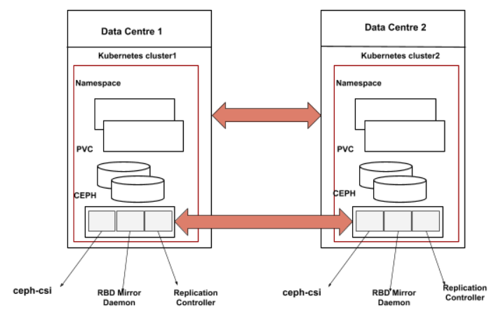

# RBD MIRRORING

RBD mirroring is a process of replication of RBD images between two or more
Ceph clusters. Mirroring ensures point-in-time, crash-consistent RBD images
between clusters, RBD mirroring is mainly used for disaster recovery (i.e.
having a secondary site as a failover). See Upstream [Ceph
documentation](https://docs.ceph.com/en/latest/rbd/rbd-mirroring) on RBD
mirroring for complete information.

## Architecture

## Design

Currently, ceph-csi generates its unique ID for each RBD image and stores the
corresponding PV name and the unique ID mapping, It creates the RBD image with
the unique ID and returns the encoded value which contains all the required
information for other operations. For mirroring, the same rbd image needs to be
used in the secondary Kubernetes cluster and the secondary ceph cluster. As
journal(omap data) is not mirrored to the secondary cluster, In the secondary
cluster the cephcsi cannot identify the rbd image corresponding to the PVC.
Based on the assumption that the Kubernetes namespace and the PVC name remain
the same when admin is doing the failover/fallback cephcsi can use the PVC name
and namespace name to identify the RBD image. For that cephcsi needs to make a
few changes.

### Pre-req

* The PVC name and namespace need to be passed to the CSI driver as part of the
  volume create request (the RBD image and omap keys/value will be derived from
  these names if it is a mirrored image).
* A new storage-class parameter to indicate that image name need to be derived
  from PVC name and namespace name.

In the case of the primary cluster as the PVC name and the namespace name
should be sent in volume create request, the cephcsi will generate omap data
and creates an RBD image with the name
`csi-vol-<pvcname>-<namespacename>-<UUID>`. When doing the failover, cephcsi in
the secondary cluster will looks for the RBD image starts with
`csi-vol-<pvcname>-<namespacename>` (From the primary cluster the omap data
maintained by ceph-csi is not mirrored to the secondary cluster). If the image
is present cephcsi will re-generate the omap data based on the parameters in
request and image UUID.

Currently, we are making use of watchers in node stage request to make sure RWO
PVC is mounted on a single node at a given point of time. We need to change the
watchers logic in the node stage request as when we enable the RBD mirroring on
an image a watcher will be added on an RBD image.

### For snapshot mirroring

This will remain the same as the naming RBD image in CreateVolume request,
here instead of the storageclass parameter, we will check the snapshotclass
parameter.

Same as PVC name and namespace name to generate the RBD image name. We will use
snapshot name and snapshot namespace name to generate the RBD image name,
created an
[issue](https://github.com/kubernetes-csi/external-snapshotter/issues/341) in
external snapshotter to pass extra snapshot metadata to create the snapshot
request.

**Note**: older PVC or Snapshots cannot be mirrored

**This design does not cover the below items:**

* Bootstrapping RBD mirror daemon.
* Mirroring for encrypted PVC.
* Mirroring for topology provisioned PVC.
* Documenting the steps to handle failover/fallback of an image.
* Workflow of a Replication controller.
