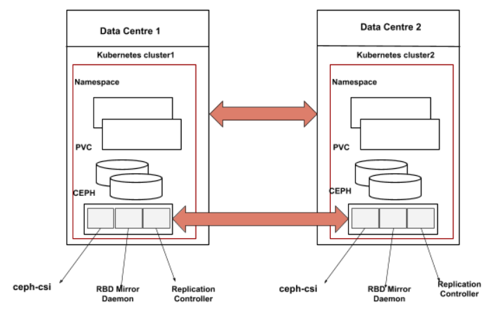

# RBD MIRRORING

RBD mirroring is a process of replication of RBD images between two or more Ceph
clusters. Mirroring ensures point-in-time, crash-consistent RBD images between
clusters, RBD mirroring is mainly used for disaster recovery (i.e. having a
secondary site as a failover).
See [Ceph documentation](https://docs.ceph.com/en/latest/rbd/rbd-mirroring) on
RBD mirroring for complete information.

## Architecture



## Design

Currently, CEPH-CSI generates its unique ID for each RBD image and stores the
corresponding PersistentVolume (PV) name and the unique ID mapping, It creates
the RBD image with the unique ID and returns the encoded value which contains
all the required information for other operations. For mirroring, the same RBD
image will be mirrored to the secondary cluster. As the journal(OMAP data) is
not mirrored to the secondary cluster, The RBD images corresponding to the PV
can not be identified without OMAP data.

**Pre-req** It's expected that the Kubernetes Admin/User will create the static
PersistentVolumeClaim (PVC) on the secondary site during the failover.

**Note:** when the static PVC created on the secondary site we cannot use the
VolumeHandle to identify the OMAP data nor the image anymore because as we have
only PoolID and ClusterID in the VolumeHandle. We cannot identify the correct
pool name from the PoolID because pool name will remain the same on both
clusters but not the PoolID even the ClusterID can be different on the secondary
cluster.

> Sample PV spec which will be used by rbdplugin controller to regenerate OMAP
> data

```yaml
csi:
  controllerExpandSecretRef:
    name: rook-csi-rbd-provisioner
    namespace: rook-ceph
  driver: rook-ceph.rbd.csi.ceph.com
  fsType: ext4
  nodeStageSecretRef:
    name: rook-csi-rbd-node
    namespace: rook-ceph
  volumeAttributes:
    clusterID: rook-ceph
    imageFeatures: layering
    imageName: csi-vol-0c23de1c-18fb-11eb-a903-0242ac110005
    journalPool: replicapool
    pool: replicapool
    radosNamespace: ""
  volumeHandle: 0001-0009-rook-ceph-0000000000000002-0c23de1c-18fb-11eb-a903-0242ac110005
```

> **VolumeHandle** is the unique volume name returned by the CSI volume plugin’s
> CreateVolume to refer to the volume on all subsequent calls.

Once the static PVC is created on the secondary cluster, the Kubernetes User can
try to delete the PVC,expand the PVC or mount the PVC. In case of mounting
(NodeStageVolume) we will get the volume context in RPC call but not in the
Delete/Expand Request. In Delete/Expand RPC request only the VolumeHandle
(`clusterID-poolID-volumeuniqueID`) will be sent where it contains the encoded
information related to ClusterID and PoolID. The VolumeHandle is not useful in
secondary cluster as the PoolID and ClusterID always may not be the same.

> In this design document we will talk about new controller(rbdplugin
> controller) not replication controller, in next releases we will design the
> replication controller to perform mirroring operations. The rbdplugin
> controller will run as a sidecar in RBD provisioner pod.

To solve this problem, We will have a new controller(rbdplugin controller)
running as part of provisioner pod which watches for the PV objects. When a PV
is created it will extract the required information from the PV spec, and it
will regenerate the OMAP data. Whenever Ceph-CSI gets a RPC request with older
VolumeHandle, it will check if any new VolumeHandle exists for the old
VolumeHandle. If yes, it uses the new VolumeHandle for internal operations (to
get pool name, Ceph monitor details from the ClusterID etc).

Currently, We are making use of watchers in node stage request to make sure
ReadWriteOnce (RWO) PVC is mounted on a single node at a given point in time. We
need to change the watchers logic in the node stage request as when we enable
the RBD mirroring on an image, a watcher will be added on a RBD image by the rbd
mirroring daemon.

To solve the ClusterID problem, If the ClusterID is different on the second
cluster, the admin has to create a new ConfigMap for the mapped ClusterID's.
Whenever Ceph-CSI gets a request, it will check if the ClusterID mapping exists
and uses the mapped ClusterID to get the information like Ceph monitors etc.
Details about creation of clusterID's mapping are available at
[clusterID-mapping](./clusterid-mapping.md).

**This design does not cover the below items:**

* Bootstrapping RBD mirror daemon.
* Mirroring of PVC snapshots
* Mirroring for topology provisioned PVC.
* Documenting the steps to handle failover/fallback of an image.
* Workflow of a Replication controller.
